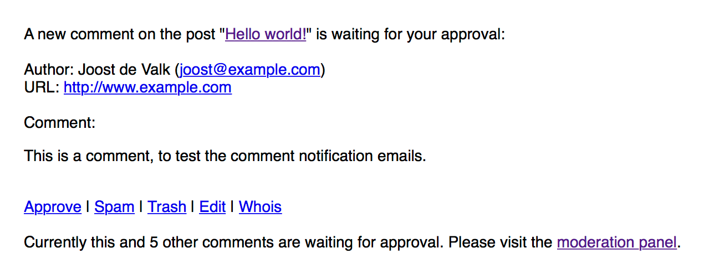
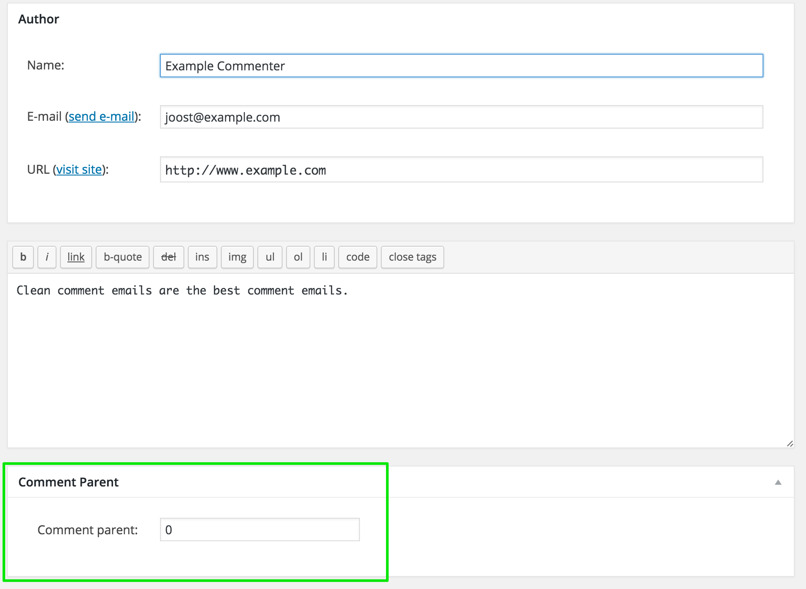
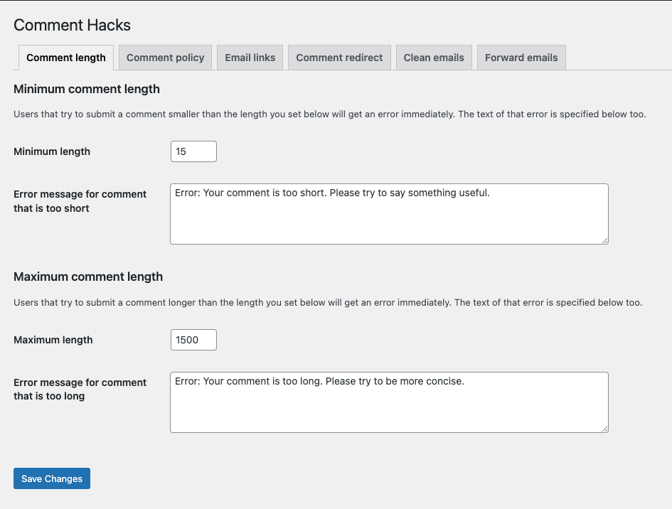
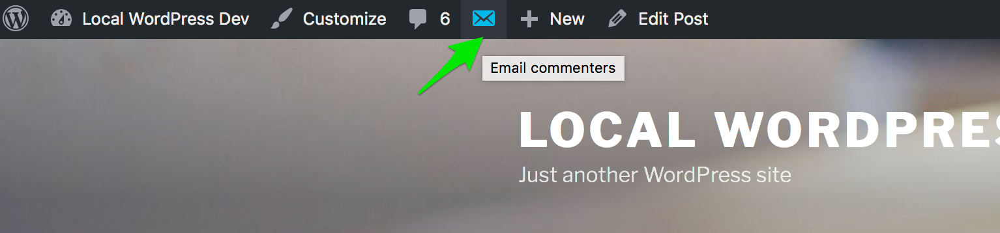
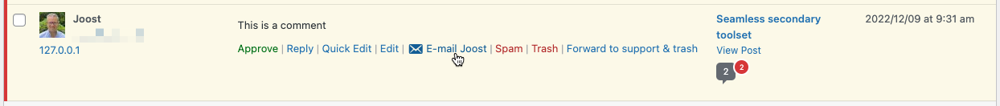

 

# Comment Hacks

Make comments management easier by applying the simple hacks Joost has gathered over the years.

## Description

This plugin adds some small hacks around core WordPress comments to make them more bearable:

* Cleaner comment notification emails.
* The option to enforce a comment policy.
* The option to forward comments to an email address (for instance for your support team) and then trash them.
* The option to disallow comments below a certain length.
* The option to redirect first time commenters to a "thank you" page.
* An input field on the comment edit screen to change the comment parent ID.
* Links in the admin comments section to email individual commenters.
* A button in the WP toolbar to email all the commenters on a post.

This repository uses [the Yoast grunt tasks plugin](https://github.com/Yoast/plugin-grunt-tasks).

## Screenshots

Screenshot of a clean comment notification email: 
 
 
The comment parent edit box: 
 
 
The plugins admin settings: 
 
 
The button on the frontend to email all the commenters on a post: 
 
 
The link in the backend to email an individual commenters on a post: 
  
