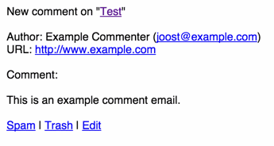
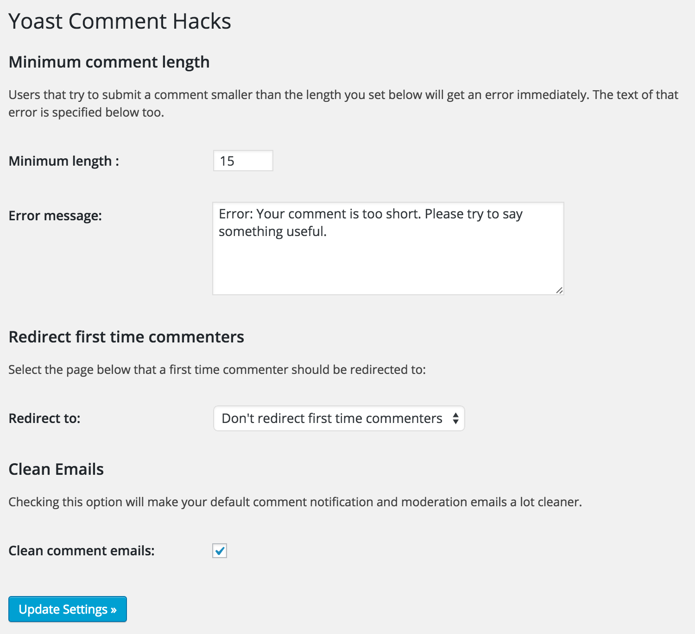

# Yoast comment hacks

Make comments management easier by applying some of the simple hacks the Yoast team uses.

## Description

This plugin adds some small hacks around core WordPress comments to make them more bearable:

* Cleaner comment notification emails.
* The option to disallow comments below a certain length.
* The option to redirect first time commenters to a thank you page.
* An input field on the comment edit screen to change the comment parent ID.

## Screenshots

Screenshot of a clean comment notification email: 

The comment parent edit box:

The plugins admin settings:
